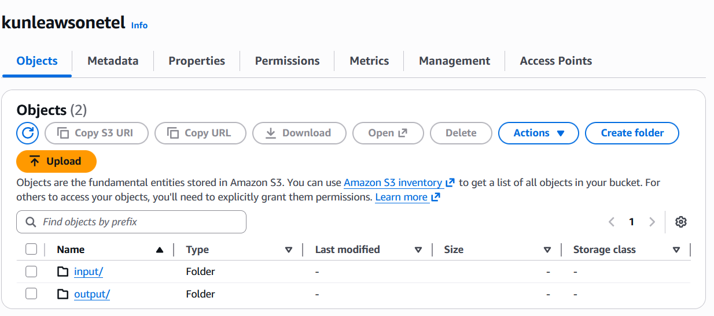
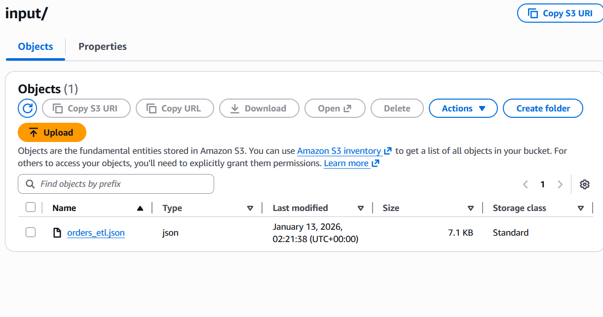
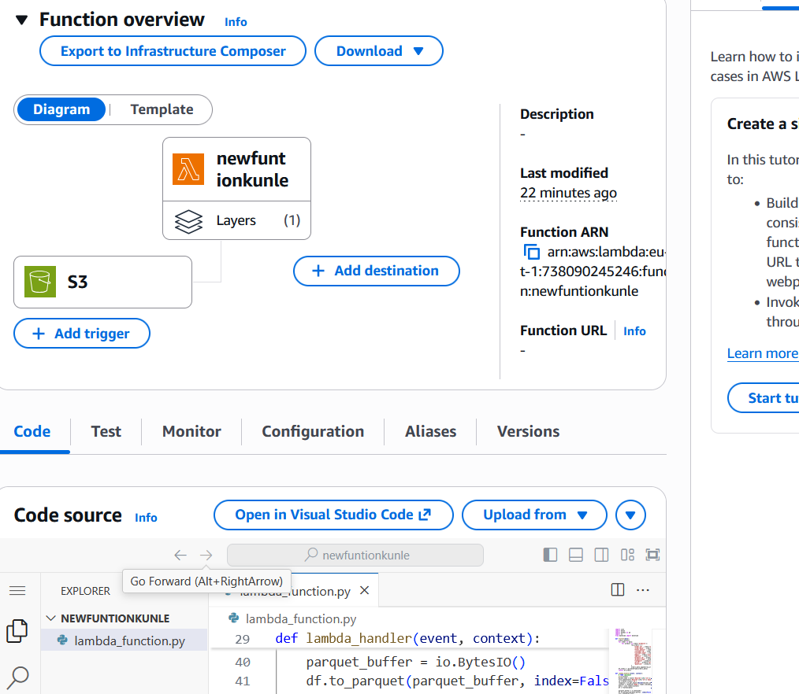
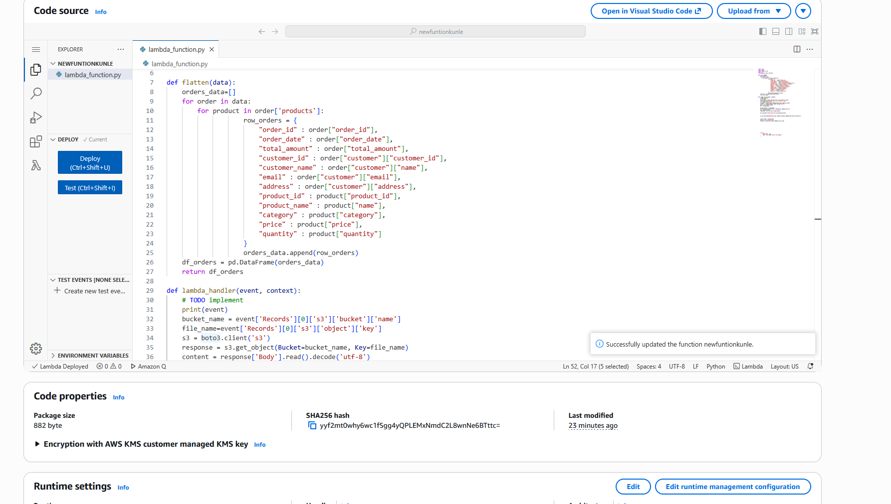
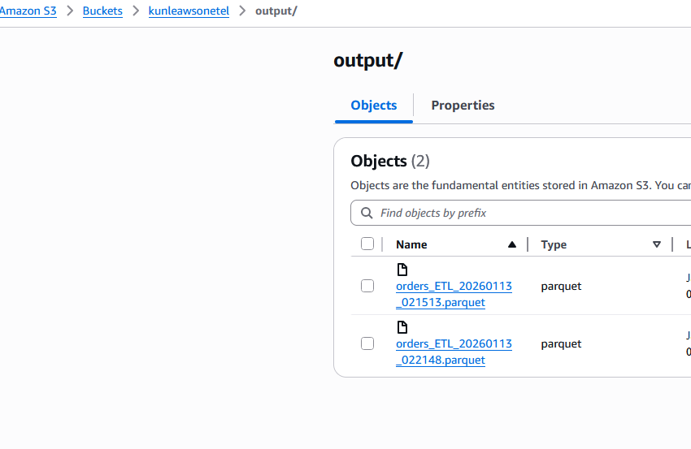
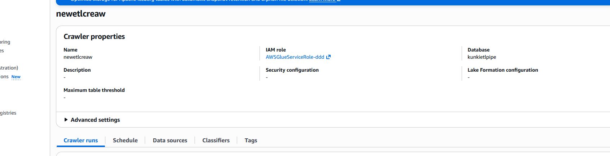
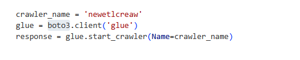

# AWS ETL Pipeline (S3 → Lambda → Parquet → Glue → Athena)

A lightweight AWS ETL pipeline that ingests **JSON files** into Amazon S3, automatically triggers an **AWS Lambda** transformation, writes the transformed data back to S3 in **Parquet** format, registers the dataset in the **AWS Glue Data Catalog**, and enables SQL querying with **Amazon Athena**.

---

## Overview

This project implements an event-driven ETL flow:

1. A JSON file is uploaded to an S3 "raw" prefix.








2. An S3 event triggers a Lambda function.





3. Lambda flattens the JSON, converts it to a Pandas DataFrame, and writes it as Parquet to an S3 "processed" prefix.







4. A Glue Crawler updates the Glue Data Catalog table based on the processed data.




5. Athena queries the processed Parquet dataset.

6. Glue datalog is automated to run crawler when a new file is processed. 




**Why Parquet?** Columnar storage reduces scan size and speeds up Athena queries.

---

## Architecture

### High-level data flow (Diagram)

```mermaid
flowchart LR
  A[Client / Data Source] -->|Upload JSON| B[(S3 Raw Bucket /raw/)]
  B -->|ObjectCreated event| C[AWS Lambda\nFlatten + Transform]
  C -->|Write Parquet| D[(S3 Processed Bucket /processed/)]
  D --> E[AWS Glue Crawler]
  E --> F[(Glue Data Catalog\nDatabase + Table)]
  F --> G[Amazon Athena\nSQL Queries]
